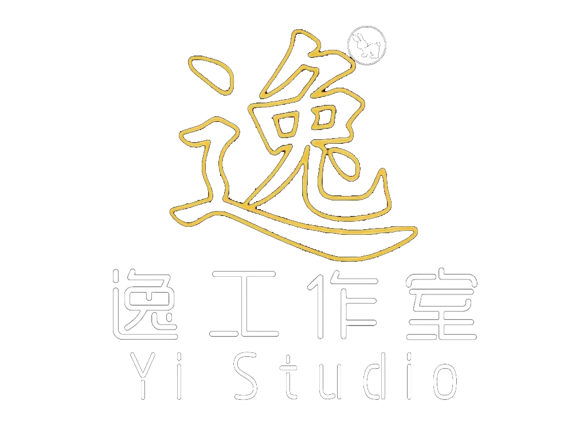
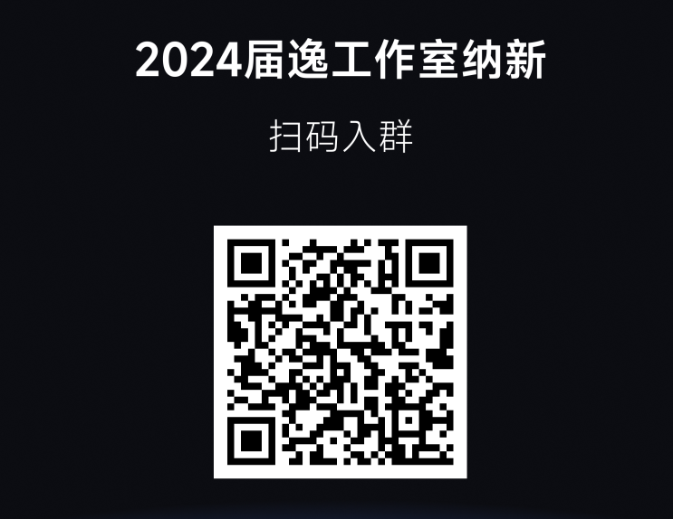

    

    <h2 style="font-size: 46px; text-shadow: #607c8a 4px 3px 4px; font-weight: bold; color: #BDA24D">逸工作室</h2>

    
——与编码爱好者同台竞技！

## **1. 社团简介**

&nbsp;&nbsp;&nbsp;&nbsp;&nbsp;&nbsp;"逸工作室”成立于2018年，隶属于科技与数据学院，是全校性学生学术科技竞赛组织之一，也是我校在科技创新与编程竞赛领域的重要力量。作为一个专注于培养技术人才的社团组织，“逸工作室”致力于为广大学生提供一个展示自我、提升技能的专业平台。

&nbsp;&nbsp;&nbsp;&nbsp;&nbsp;&nbsp;我们通过精心组织和指导学生参与多项具有影响力的大学生课外学术竞赛，如“蓝桥杯”全国软件和信息技术专业人才大赛、“软件杯”全国软件设计大赛、"中国大学生软件设计大赛"国内顶级软件开发赛事以及全球知名的“ICPC国际大学生程序设计竞赛”等。这些比赛不仅是展示个人技术水平的舞台，更是同学们磨砺思维、锻炼团队协作能力的重要机会。

&nbsp;&nbsp;&nbsp;&nbsp;&nbsp;&nbsp;自成立以来，“逸工作室”在各类竞赛中斩获佳绩，累计获得数十项省级、国家级奖项，成绩斐然。我们的成员在一次次的竞赛中不断挑战自我、突破极限，不仅收获了荣誉，更提升了编程、算法设计、系统开发等实用技能，为未来的职业生涯打下坚实基础。

&nbsp;&nbsp;&nbsp;&nbsp;&nbsp;&nbsp;“逸工作室”不仅是一个学习和竞赛的平台，更是一个助力同学们成长的大家庭。我们欢迎每一位热爱技术、勇于创新的同学加入，共同在科技的世界里追求卓越，书写属于自己的精彩篇章！

## **2. 部门介绍**

逸工作室根据赛事方向主要分为两大部门：

### **算法部门**

&nbsp;&nbsp;&nbsp;&nbsp;&nbsp;&nbsp;竞赛部门专注于提升成员的算法能力，算法不仅是参加各类编程竞赛的核心，更是求职面试和考研复试中的重要技能。在这里，我们以“蓝桥杯”、“CCPC/ICPC”等知名算法竞赛为导向，进行系统化的算法训练。通过学习各种经典算法，你将深入理解算法的本质，掌握从问题分析到高效解决的全过程。优秀的算法设计不仅能够优化程序运行效率，还能让你在实际开发中脱颖而出，成为技术精湛的开发者。在竞赛部门，你将探索算法的多样性，学习如何灵活应用，切实提升编程效率和技术水平。

### **开发部门**

&nbsp;&nbsp;&nbsp;&nbsp;&nbsp;&nbsp;开发部门致力于培养成员的软件开发能力，通过项目实践和团队协作，帮助你掌握从设计到实现的全栈开发技能。实验室设备齐全，学习环境优越，24小时供给水电网，能够满足各种开发需求。在这里，我们不仅会指导你参与“软件杯”等开发类竞赛，还会通过实战项目让你熟悉软件工程的流程与规范。通过团队合作，你将学会如何解决实际开发中的问题，提升代码编写和项目管理能力，为未来的职业生涯做好充分准备。如果你计划考研，丰富的项目经验将成为你在复试中脱颖而出的有力砝码，极大提升你的专业竞争力和面试表现。无论是走向职场还是深造考研，开发部门都将助你一臂之力。

## **3. 社团优势**

- 各类竞赛经验分享：我们不仅限于算法竞赛，各类型比赛均有涉及，有丰富竞赛经验的学长进行指导。
- 项目实战：不定期进行实际开发项目，从零到一学习开发流程，多人开发多人交流共同进步。
- 丰富资源：逸工作室免费提供多样的编程资源、在线课程和学习资料，助你快速成长。
- 社团活动：定期举办编程竞赛、技术分享会、团队建设活动，丰富你的大学生活。

## **4. 获奖经历**

我们汇集了近三年的部分获奖经历，将其分为程序设计竞赛类、软件设计开发类、学科竞赛类：

**程序设计竞赛类**

- 第十三至十五届蓝桥杯程序设计竞赛大赛：国奖2项，省奖数十项
- 第五届至六届计算机能力挑战赛程序设计挑战赛：国奖1项
- 第五届至六届传智杯程序设计竞赛：省奖7项。

**软件设计开发类**

- 全国大学生软件设计大赛：国奖1项
- 大学生服务外包创新创业大赛：省奖1项
- 山东省网络技术大赛：省奖1项
- 第五届计算机能力挑战赛人工智能挑战赛：省奖1项
- 第五届计算机能力挑战赛虚拟现实赛道：省奖1项

**学科竞赛类**

- 全国大学生数学建模大赛：省奖2项
- 山东省大学生物理创新竞赛：省奖1项
- 山东省大学生科技翻译大赛：省奖2项

## **5. 招新对象**

- 招募对象：24届夏考同学、24届春考同学、24届专升本同学、23届春夏考同学。
- 要求：热爱编程、有团队合作精神、渴望参与创新项目和比赛。

## **6. 联系方式**

- 逸工作室(ICPC实验室)地点：68号楼E313
- 2024届逸工作室纳新群号： [558345194](http://qm.qq.com/cgi-bin/qm/qr?_wv=1027&k=MvMsvQTU4ZAa4uhJV1q1pyIWBTeRtlBw&authKey=wliELiV7CIH%2BKb0uqILvVJwCh3MFDy2vxLc9qykcgEctX6OZAJyKtnAe1tD0zfwd&noverify=0&group_code=558345194)
- 相关问题可直接联系群内管理人员。
- 其他问题联系邮箱：[dean256969@gmail.com](http://dean256969@gmail.com)

